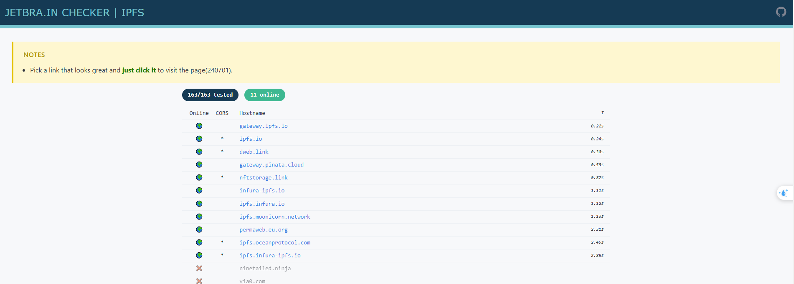
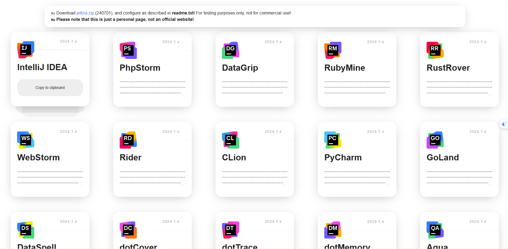
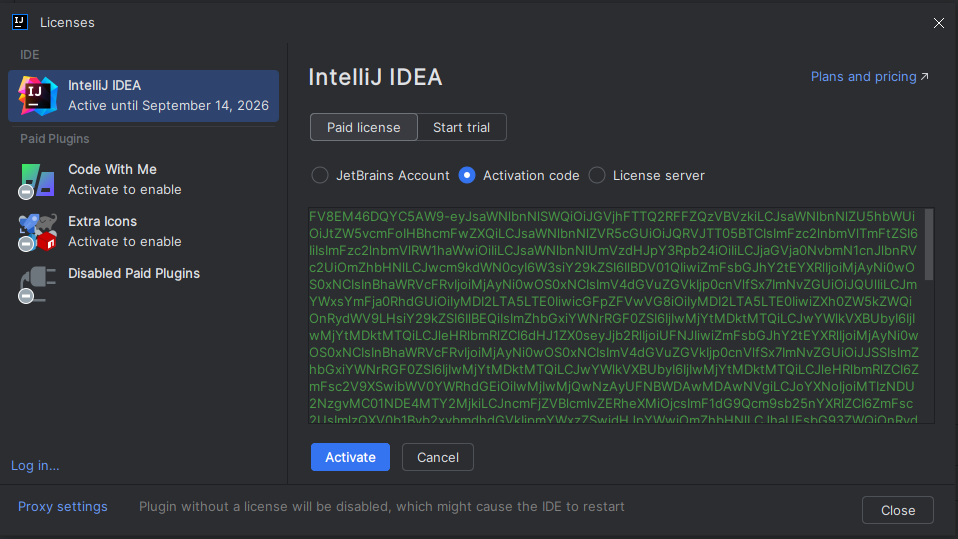
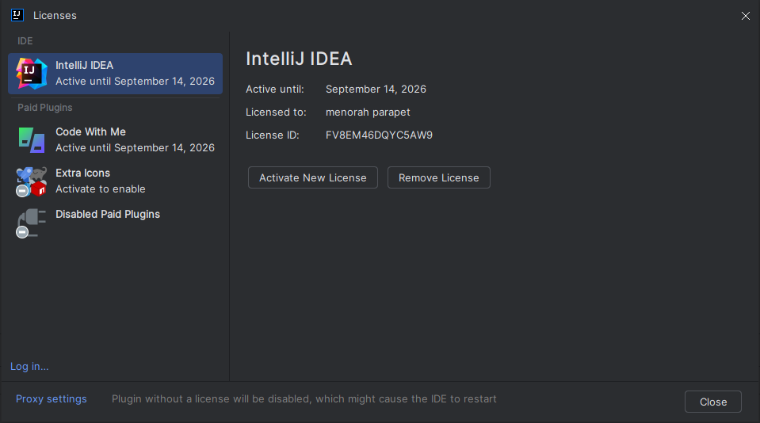

# Hướng dẫn kích hoạt tài khoản JetBrains (FREE)

## Bước 1: Cài đặt IntelliJ IDEA
- Tải và cài đặt IntelliJ IDEA từ trang chủ của JetBrains.

## Bước 2: Clone repository công cụ hỗ trợ kích hoạt
- Tại thư mục `...\Program Files\JetBrains`, mở terminal và chạy lệnh sau để clone repo hỗ trợ kích hoạt:
    ```bash
    git clone https://github.com/hieumai1905/tool-crack-jetbrains.git
    ```

## Bước 3: Chỉnh sửa Custom VM Options
- Truy cập vào file `idea64.exe.vmoptions` theo đường dẫn sau:
    ```bash
    C:\Users\{user}\AppData\Roaming\JetBrains\IntelliJIdea2024.1\idea64.exe.vmoptions
    ```
- Thêm 3 dòng code sau vào cuối file:
    ```bash
    --add-opens=java.base/jdk.internal.org.objectweb.asm=ALL-UNNAMED
    --add-opens=java.base/jdk.internal.org.objectweb.asm.tree=ALL-UNNAMED
    -javaagent:C:\Program Files\JetBrains\tool-crack-jetbrains\ja-netfilter.jar=jetbrains
    ```

## Bước 4: Khởi động lại ứng dụng
- Sau khi chỉnh sửa, khởi động lại IntelliJ IDEA.

## Bước 5: Lấy Activation Code
- Truy cập vào đường dẫn sau để lấy mã kích hoạt: https://3.jetbra.in/
- Chọn 1 server bất kỳ:
    
- Chọn IDE cần activate và copy code:
    

## Bước 6: Active License
- Trong IntelliJ, chọn `Paid License`, sau đó chọn `Activation code`.
- Paste đoạn mã Activation Code đã copy vào và nhấn "Activate".
    

## HOÀN THÀNH
- Bạn đã kích hoạt thành công! Bây giờ có thể tận hưởng toàn bộ tính năng của JetBrains IDE.

